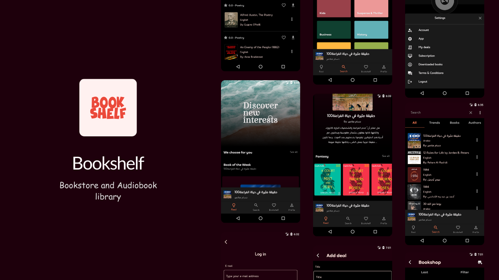
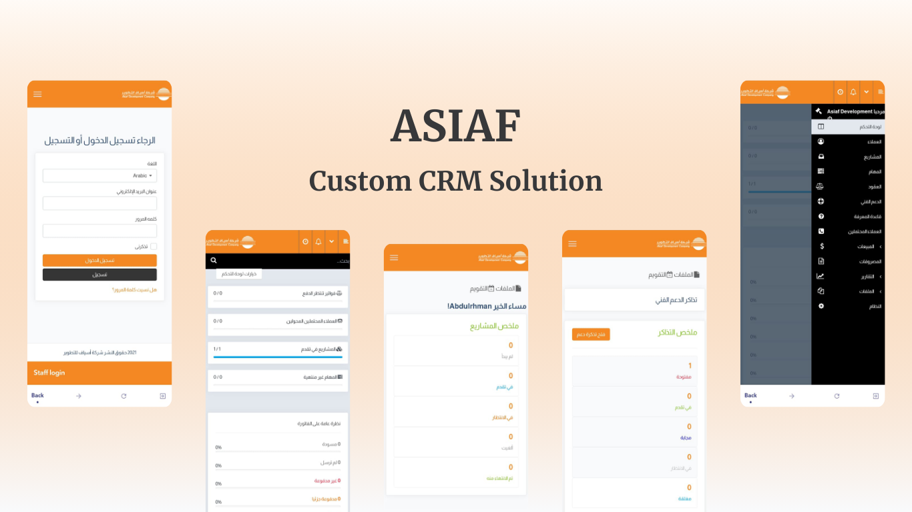
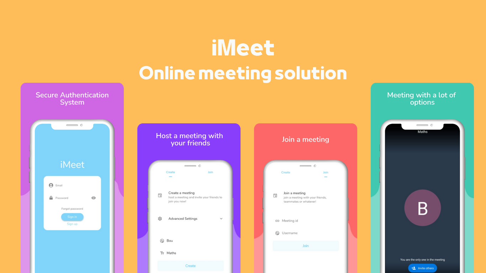
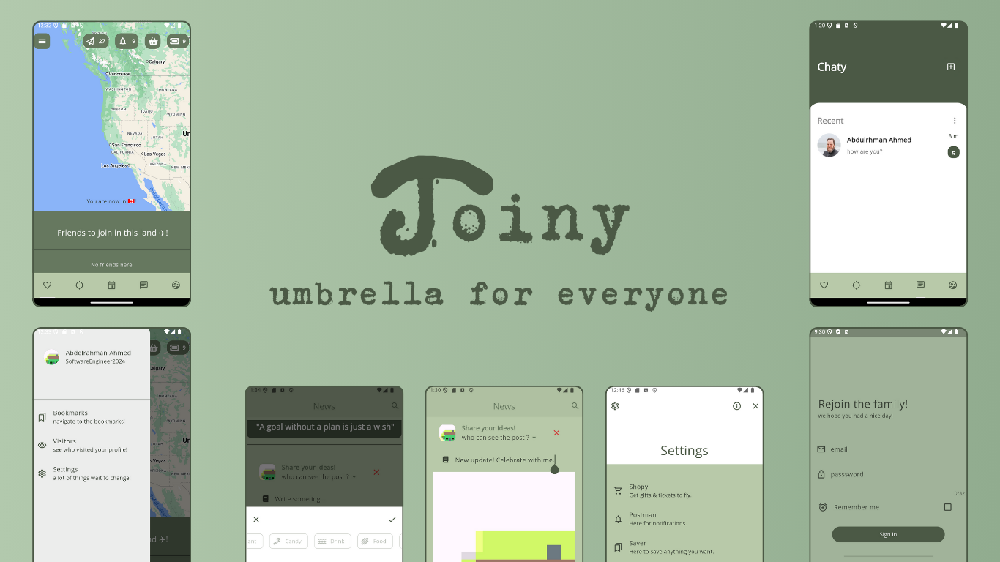

# showcase-apps

As a Full Stack Software Engineer, I build mobile apps, and backend systems. Some of my apps and work can be found here. I'd be happy if you contact me at bouprogramming@gmail.com

---

**Apps included**

1. Bookshelf - Online Bookstore and Audiobook library

   
   <h2>Key features:</h2>
   ✅ Authentication with Google Sign in
   ✅ Localization
   ✅ State Management
   ✅ UI/UX Prototyping
   ✅ Animations
   ✅ Firebase Analytics & Crashlytics
   ✅ Restful API
   ✅ MVC Architecture
   ✅ Express.js
   ✅ MongoDB
   ✅ JWT
   ✅ Agile Methodologies
   ✅ Pagination & Lazy Loading
   ✅ CRSF & XSS attacks handling
   ✅ Clean code with documentation
   ✅ Input Validation & Sanitization
   ✅ Routing
   ✅ Rate Limiting & Top Security approaches
   ✅ NPM
   ✅ Javascript ES6+
   ✅ Postman
   ✅ CI/CD
   ✅ Git/Github

     
   
   <a href='https://github.com/boucoding/showcase-apps/tree/main/Bookshelf'>
     <button style="background-color: #1e000c; color: white; padding: 10px 24px; border: none; border-radius: 3px; text-align: center; font-weight: bold;">
     See Screenshots
   </button>
   </a>

    
2. Asiaf - Custom CRM Solution - 2021

   
   <h2>Key features:</h2>
   ✅ UI/UX Prototyping
   ✅ State Management
   ✅ Localization
   ✅ Animations
   ✅ Error handling
   ✅ Routing
   ✅ Deployed to App Store & Google Play
     
   <a href='https://github.com/boucoding/showcase-apps/tree/main/Asiaf'>
     <button style="background-color: #f48823; color: white; padding: 10px 24px; border: none; border-radius: 3px; text-align: center; font-weight: bold;">
     See Screenshots
   </button>
   </a>

    
3. iMeet - Online Meeting Solution

    
      
    <h2>Key features:</h2>
    ✅ UI/UX Prototyping
    ✅ State Management
    ✅ Online Video Calling
    ✅ Managing call sessions
    ✅ Localization
    ✅ Animations
    ✅ Error handling
    ✅ Routing
    ✅ Easy Authentication system

      
     <a href='https://github.com/boucoding/showcase-apps/tree/main/iMeet'>
     <button style="background-color: #ffbd59; color: white; padding: 10px 24px; border: none; border-radius: 3px; text-align: center; font-weight: bold;">
     See Screenshots
   </button>
   </a>

     
4. Joiny - Social media for everyone - 2021 ~ 2024

    
      
    <h2>Key features:</h2>
    ✅ Authentication 
   ✅ Code Refactoring from +2k lines of error
   ✅ Google Maps
   ✅ Realtime data update
   ✅ Socket.io / Websockets
   ✅ Redis Cache
   ✅ Geolocation
   ✅ Permission Handling
   ✅ In-App Store
   ✅ Realtime chats
   ✅ File Uploading
   ✅ Dependency Injection
   ✅ State Management
   ✅ UI/UX Prototyping
   ✅ Animations
   ✅ Restful API
   ✅ MVC Architecture
   ✅ Express.js
   ✅ MongoDB
   ✅ JWT
   ✅ Pagination & Lazy Loading
   ✅ Clean code with documentation
   ✅ Input Validation & Sanitization
   ✅ Routing
   ✅ Rate Limiting 
   ✅ NPM
   ✅ Javascript ES6+
   ✅ Postman
   ✅ CI/CD
   ✅ Git/Github

      
     <a href='https://github.com/boucoding/showcase-apps/tree/main/iMeet'>
     <button style="background-color: #4B5945; color: white; padding: 10px 24px; border: none; border-radius: 3px; text-align: center; font-weight: bold;">
     See Screenshots
   </button>
   </a>

     
Please don't hesitate to contact me. I am open to any messages. feel free to reach me at bouprogramming@gmail.com.

Thank you for reading this!
